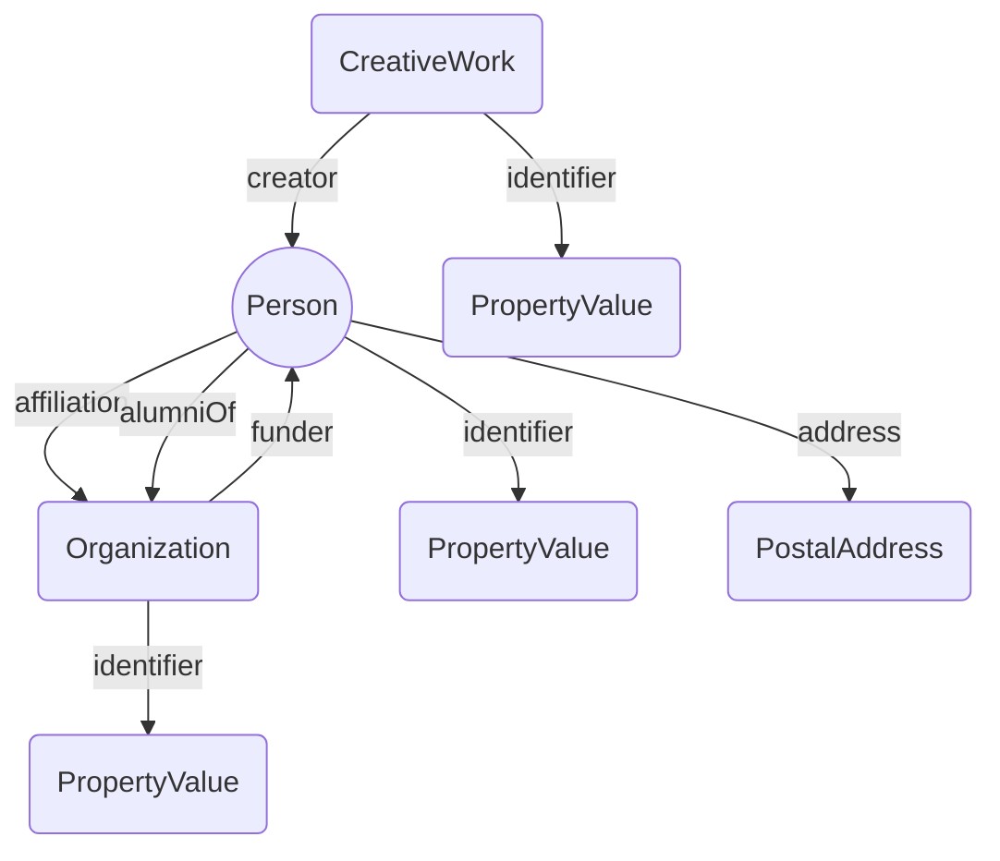

# Linked data for ORCID

Fetch ORCID JSON-LD and convert to triples.

Lots of minor problems with ORCID JSON-LD that need to be dealt with, such as URLs that aren’t really URLs (contain spaces, bad characters, etc.). Also need to ensure URLs don’t contain characters such as `<>[]`.

Note also that I generate globally unique blank node ids so that we can split the triples into chunks and still upload without causing issues.

Fetching mode is to grab JSON-LD, cache it, convert each file to triples and store in same cache, then to upload we can retrieve each triples file and upload that (great for testing).

For distribution we would concatenate all triples into one big file and distribute that.

## ORCID data model

The diagram below summarises the ORCID data model of people connected to works, organisations, and addresses.



## Triples and quads

To get/refresh raw JSON-LD data data use `fetch.php`. Run `triples.php` to update triples for new ORCID records.

To generate all triples use `bulk.php`. To generate all quads (each with the corresponding ORCID id as the URI for the graph) then use `bulk-nquads.php`).

### Uploading

To upload squads use `chunk-nquads.php` which generates chunks and then uploads to triple store.

## Problems

### ORCID context requires internet

ORCID sets the context as a simple URL:

```
 "@context" : "http://schema.org",
```

`ML\JsonLD` therefore tries to resolve  `http://schema.org` for **every** JSON-LD file when we serialise it as triples! To avoid this I rewrite the `@context` to be an object with `@vocab`. This enables us to serialise the JSON-LD but means we may misinterpret some aspects of the RDF. For example, `sameAs` is output as an array of strings when it should be an array of URIs. Hence we have to add specific handlers for this in the new context.

### sameAs

`sameAs` should be an array of URIs but often ORCID includes strings. I’ve added this issue to https://github.com/ORCID/ORCID-Source/issues/6542. Note that `sameAs` can also link things that are not the same, such as articles and journals, see https://github.com/ORCID/ORCID-Source/issues/7005

### Specific ORCIDs

0000-0002-0633-5974 is 2.8 mb in size and breaks `triples.php`. Need to increase memory:

```
php -d memory_limit=-1 triples.php
```

### URLs that aren’t URLs

See for example https://github.com/ORCID/ORCID-Source/issues/6542

### GRID ids are not URIs

See https://github.com/ORCID/ORCID-Source/issues/6519 ORCID uses GRID as `@id` but doesn’t render them as URIs, so triples break, e.g.

```
"affiliation" : [ {
   "@type" : "Organization",
   "@id" : "grid.1214.6",
   "name" : "Smithsonian Institution"
  }
```

### RORs 
ORCID encodes ROR ids as URLs but in a `PropertyValue`, whereas I think the URL should be used as `@id` and the slug after the `https://ror.org/` should be used as the `value`.

```
{
   "@type": "Organization",
   "name": "ORCID",
   "alternateName": "Product",
   "identifier": {
      "@type": "PropertyValue",
      "propertyID": "ROR",
      "value": "https://ror.org/04fa4r544"
      }
},
```

See https://github.com/ORCID/ORCID-Source/issues/6520 for further discussion.

### ISSNs

Some ORCID records assert that the DOI is the sameAs the ISSN for the journal(!). See https://github.com/ORCID/ORCID-Source/issues/7005

## SPARQL

Examples of queries.

```
DESCRIBE <https://orcid.org/0000-0002-9500-4244>
```

```
PREFIX : <http://schema.org/>
PREFIX rdf: <http://www.w3.org/1999/02/22-rdf-syntax-ns#>
PREFIX rdfs: <http://www.w3.org/2000/01/rdf-schema#>
SELECT * 
FROM <https://orcid.org>
WHERE {
  ?funder :funder ?person .
  ?funder :name ?name .
}
LIMIT 10
```

